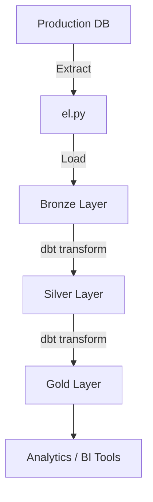

```markdown
# Simple Data Warehouse

A **complete, end-to-end ELT pipeline** showcasing real-world data engineering practices using modern open-source tools.

---

## System Design


---

## Technologies Used

| Tool                | Purpose                                    |
|---------------------|--------------------------------------------|
| **Docker & Docker Compose** | Containerize and orchestrate services     |
| **PostgreSQL**      | OL resinsTP (production) & OLAP (warehouse) |
| **Python**          | Extract & Load (EL) phase                  |
| `psycopg2-binary`   | PostgreSQL connectivity                    |
| `pandas`            | Data manipulation                          |
| **dbt**             | Data transformations (T)                   |
| **Apache Airflow**  | Pipeline orchestration                     |

---

## Project Structure

```bash
.
├── airflow/
│   ├── dags/
│   │   └── orchestrator.py           # Airflow DAG
│   └── Dockerfile                    # Custom Airflow image (optional)
│
├── docs/
│   ├── prod_design_simple.png        # OLTP schema diagram
│   └── thinking.txt                  # Design notes
│
├── scripts/
│   ├── prod/
│   │   ├── schema_simple.sql         # OLTP schema
│   │   └── seed_simple.py            # Seed production data
│   └── dw/
│       ├── el.py                     # Extract & Load script
│       ├── init_wh_simple.sql        # Initialize warehouse
│       └── xyz_store_analytics/      # dbt project
│
├── docker-compose.yaml               # All services definition
└── pyproject.toml                    # Python dependencies
```

---

## Getting Started

### Prerequisites

- [Docker](https://www.docker.com/)
- [Docker Compose](https://docs.docker.com/compose/)

---

### Setup & Run

```bash
# 1. Clone the repo
git clone <your-repo-url>
cd simple-datawarehouse

# 2. Start all services
docker-compose up --build
```

This launches:
- `production_db` → OLTP source
- `dwh` → Data warehouse
- `airflow_orchestrator` → Airflow instance

---

### Seed Production Data

```bash
# Apply schema
docker exec -it production_db psql -U admin -d xyz_store < scripts/prod/schema_simple.sql

# Seed sample data
python scripts/prod/seed_simple.py
```

---

## ELT Pipeline Overview



---

## Data Modeling (Medallion Architecture)

| Layer   | Purpose                              | Example Tables                     |
|---------|--------------------------------------|------------------------------------|
| Bronze  | Raw, unprocessed data                | `raw_orders`, `raw_customers`      |
| Silver  | Cleaned, validated, conformed        | `clean_orders`, `clean_customers`  |
| Gold    | Aggregated, business-ready (Star Schema) | `fact_sales`, `dim_*`           |

---

## Orchestration with Airflow

DAG: `airflow/dags/orchestrator.py`

### Tasks:
1. `extract_and_load_bronze` → Runs `el.py`
2. `dbt_run_models` → Executes all dbt models
3. `dbt_test_models` → Runs data quality tests
4. `dbt_return_sample` → Optional preview

**Airflow UI**: [http://localhost:8000](http://localhost:8000)  
*(Default login: `airflow` / `airflow`)*

---

## Future Enhancements

- [ ] Add incremental models in dbt
- [ ] Implement snapshotting for slowly changing dimensions
- [ ] Integrate data quality monitoring (Great Expectations)
- [ ] Add email/Slack alerts on failure
- [ ] Schedule daily runs via Airflow cron

---

## Summary

| Stage           | Tool                        | Responsibility                     |
|-----------------|-----------------------------|-------------------------------------|
| Extract & Load  | Python + `psycopg2` + `pandas` | Pull & stage raw data              |
| Transform       | **dbt**                     | Clean → Model → Aggregate           |
| Orchestrate     | **Apache Airflow**          | Schedule & monitor full pipeline    |
| Store           | **PostgreSQL**              | OLTP + OLAP persistence             |

---

**Ready for analytics. Built to scale.**
```